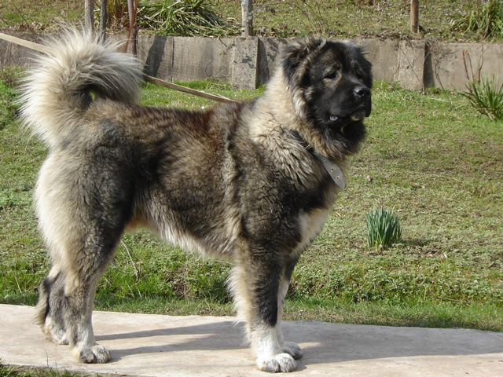
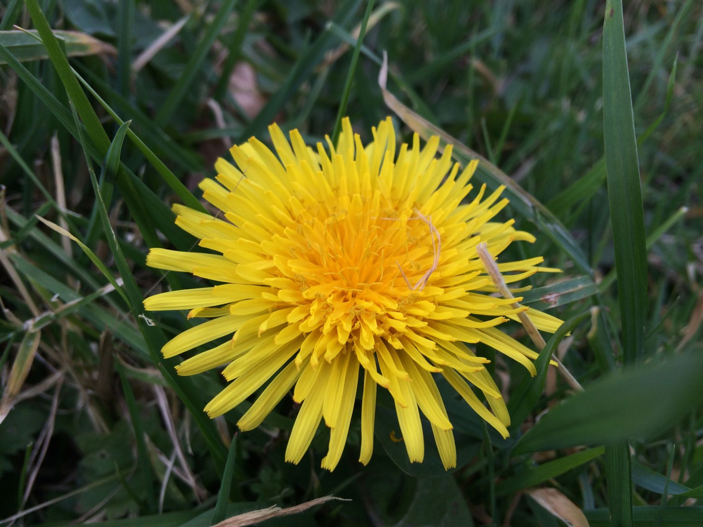
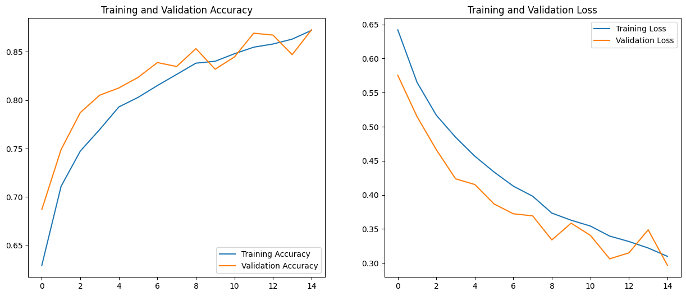
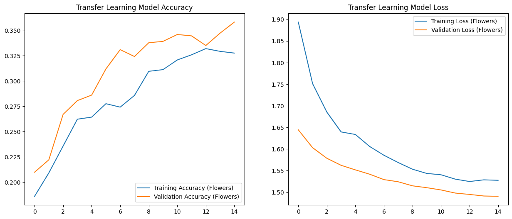
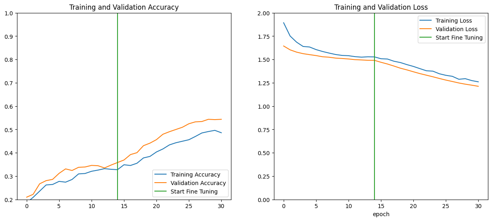

# Transfer Learning Project: From Cats vs Dogs to Flower Classification


A comprehensive deep learning project demonstrating the power of transfer learning and fine-tuning using TensorFlow and Keras. This project showcases how knowledge learned from one task (cats vs dogs classification) can be effectively transferred and fine-tuned to solve different but related problems (flower classification).

## 🚀 Project Overview

This project implements a three-stage deep learning approach:

1. **Stage 1**: Train a Convolutional Neural Network (CNN) from scratch on the cats vs dogs dataset
2. **Stage 2**: Use transfer learning to adapt the model for flower classification
3. **Stage 3**: Apply fine-tuning techniques to further improve performance

The project demonstrates how transfer learning and fine-tuning can significantly reduce training time while achieving superior performance on new tasks with limited data.

## 🎯 Key Features

- **Custom CNN Architecture**: Built from scratch with data augmentation layers
- **Transfer Learning Implementation**: Freezing pre-trained layers and adding new classification heads
- **Fine-Tuning Optimization**: Unfreezing top layers for domain-specific adaptation
- **Multi-class Classification**: Extends from binary (cats vs dogs) to 5-class (flowers) classification
- **Data Augmentation**: Random flips, rotations, and zoom for better generalization
- **Performance Visualization**: Comprehensive training history plots and model evaluation metrics

## 🛠️ Technologies Used

- **TensorFlow 2.18.0**: Deep learning framework
- **TensorFlow Datasets**: Pre-built datasets
- **Matplotlib**: Data visualization and performance plotting
- **Python**: Programming language
- **Jupyter Notebook**: Interactive development environment

## 🚀 Getting Started

### Prerequisites

- Python 3.7+
- TensorFlow 2.x
- Matplotlib
- Jupyter Notebook or Google Colab

### Recommended: Google Colab with GPU

For optimal performance, we **strongly recommend** using Google Colab with GPU acceleration:

[](https://colab.research.google.com/drive/1vZjwj8QYsQj-oeMZ7yFTxaOk_Vu4b3h9?usp=sharing)

**Why Google Colab?**
- **Free GPU access** (GPUS: T4)
- Pre-installed deep learning libraries
- No local setup required
- **Faster training times** (especially for fine-tuning)
- **Better performance** for compute-intensive operations

### Usage Options

#### Option 1: Google Colab (Recommended)
1. Open the [notebook in Google Colab](https://colab.research.google.com/drive/1vZjwj8QYsQj-oeMZ7yFTxaOk_Vu4b3h9?usp=sharing)
2. Run all cells to train the models
3. The model will be saved automatically

#### Option 2: Local Usage
1. Clone this repository:
```bash
git clone <repository-url>
cd transfer-learning-project
```

2. Install dependencies:
```bash
pip install tensorflow tensorflow-datasets matplotlib jupyter
```

3. Run the notebook:
```bash
jupyter notebook Dog_X_Cat_CNN_TF.ipynb
```

#### Option 3: Use Pre-trained Model
```python
import tensorflow as tf

# Load pre-trained model
model = tf.keras.models.load_model('models/cats_vs_dogs_base_model.keras')

# Use for predictions...
```

## 📊 Datasets

1. **Cats vs Dogs**: TensorFlow Datasets - Binary classification
   - Training images: ~20,000 samples
   - Validation: ~5,000 samples

2. **TF Flowers**: TensorFlow Datasets - 5 flower classes
   - Classes: daisy, dandelion, roses, sunflowers, tulips
   - Training images: ~2,900 samples
   - Validation: ~730 samples

## 🖼️ Sample Images

### Training Examples

| Cats | Dogs | Flowers |
|------|------|----------|
|  |  |  |

The project includes sample images in the `img/material/` directory for testing and demonstration purposes.

## 🏗️ Model Architecture & Performance

### Base Model (Cats vs Dogs)


- **Input Layer**: 128x128x3 RGB images
- **Data Augmentation**: Random horizontal flip, rotation (0.1), zoom (0.1)
- **Convolutional Blocks**: 3 blocks with increasing filters (32, 64, 128)
- **Pooling**: MaxPooling2D after each convolutional block
- **Dense Layers**: 64 neurons with ReLU activation + Dropout (0.5)
- **Output**: Single neuron with sigmoid activation (binary classification)
- **Performance**: ~80-90% validation accuracy

### Transfer Learning Model (Flowers)


- **Frozen Base**: Pre-trained cats vs dogs model (without final layer)
- **New Head**: Dense layer with 5 neurons and softmax activation
- **Trainable Parameters**: Only 325 parameters (vs 1.7M in base model)
- **Performance**: ~35-50% validation accuracy (5-class problem)

### Fine-Tuned Model (Enhanced Flowers)


- **Unfrozen Layers**: Top convolutional layers made trainable
- **Lower Learning Rate**: Prevents catastrophic forgetting
- **Enhanced Performance**: Significant improvement over basic transfer learning

## 🔬 Transfer Learning & Fine-Tuning Explained

### What is Transfer Learning?

Transfer learning leverages knowledge from a pre-trained model to solve a related but different task:

1. **Feature Extraction**: Base model learns universal image features (edges, textures, shapes)
2. **Knowledge Transfer**: These features are relevant across different image domains
3. **Task Adaptation**: New classification head learns task-specific patterns

### What is Fine-Tuning?

Fine-tuning is an advanced transfer learning technique where we:
1. Start with a pre-trained model
2. Replace the final layer for our specific task
3. **Unfreeze some of the top layers** of the pre-trained model
4. Train the entire network with a **very low learning rate**

### Why Fine-Tuning Works Better

**Transfer Learning Only:**
- Uses pre-trained features as-is
- Only trains the new classification head
- Limited adaptation to new domain

**Transfer Learning + Fine-Tuning:**
- Adapts high-level features to new domain
- Maintains low-level feature knowledge
- Achieves better domain-specific performance
- **Results in significantly higher accuracy**

### The Complete Learning Pipeline

1. **Base Model Training**: ~15 epochs on cats vs dogs dataset
2. **Transfer Learning**: Freeze base, train new head (~15 epochs)
3. **Fine-Tuning**: Unfreeze top layers, train with low learning rate (~10-15 epochs)

### Key Fine-Tuning Strategies

- **Gradual Unfreezing**: Start with frozen base, gradually unfreeze layers
- **Learning Rate Scheduling**: Use lower learning rates for pre-trained layers
- **Early Stopping**: Monitor validation loss to prevent overfitting
- **Data Augmentation**: Maintain augmentation throughout fine-tuning

### Performance Improvements

As shown in our model performance graphs:
- **Basic Transfer Learning**: ~35-40% accuracy on flower classification
- **With Fine-Tuning**: **Substantial improvement** in both training and validation accuracy
- **Faster Convergence**: Fine-tuning reaches optimal performance in fewer epochs
- **Better Generalization**: Reduced overfitting compared to training from scratch

## 🤖 Trained Models

### cats_vs_dogs_base_model.keras
- **Location**: `models/cats_vs_dogs_base_model.keras`
- **Description**: Base model trained for cats vs dogs classification
- **Architecture**: CNN with data augmentation layers
- **Accuracy**: ~80-90% on validation set
- **Parameters**: 1,699,009 trainable
- **File Size**: ~20MB

### How to Use the Saved Model

```python
import tensorflow as tf
from tensorflow.keras.preprocessing import image
import numpy as np

# Load the trained model
model = tf.keras.models.load_model('models/cats_vs_dogs_base_model.keras')

# Make prediction on a new image
def predict_image(img_path):
    # Load and preprocess the image
    img = image.load_img(img_path, target_size=(128, 128))
    img_array = image.img_to_array(img)
    img_array = np.expand_dims(img_array, axis=0)
    img_array /= 255.0
    
    # Make prediction
    prediction = model.predict(img_array)
    
    if prediction[0] > 0.5:
        return f"It's a dog! (Confidence: {prediction[0][0]:.2%})"
    else:
        return f"It's a cat! (Confidence: {1-prediction[0][0]:.2%})"

# Example usage
result = predict_image('img/material/Cat.jpg')
print(result)
```

### Testing with Sample Images

The project includes test images in the `img/material/` folder:
- `Cat.jpg` - For testing cat classification
- `Dog.jpg` - For testing dog classification
- `Dandelion.jpg` - To demonstrate how the model responds to other classes

```python
# Test with all sample images
test_images = [
    'img/material/Cat.jpg',
    'img/material/Dog.jpg',
    'img/material/Dandelion.jpg'
]

for img_path in test_images:
    result = predict_image(img_path)
    print(f"{img_path}: {result}")
```

### Quick Model Testing

To quickly test the model with the provided sample images:

```python
# Quick test script
import tensorflow as tf
from tensorflow.keras.preprocessing import image
import numpy as np

# Load model
model = tf.keras.models.load_model('models/cats_vs_dogs_base_model.keras')

# Test function
def quick_test():
    test_images = {
        'Cat': 'img/material/Cat.jpg',
        'Dog': 'img/material/Dog.jpg',
        'Flower': 'img/material/Dandelion.jpg'
    }
    
    for label, path in test_images.items():
        img = image.load_img(path, target_size=(128, 128))
        img_array = image.img_to_array(img) / 255.0
        img_array = np.expand_dims(img_array, axis=0)
        
        prediction = model.predict(img_array)[0][0]
        result = "Dog" if prediction > 0.5 else "Cat"
        confidence = prediction if prediction > 0.5 else 1 - prediction
        
        print(f"{label} image -> Predicted: {result} (Confidence: {confidence:.2%})")

quick_test()
```

## 📈 Expected Results

| Model Type | Accuracy | Training Time | Parameters Trained |
|------------|----------|---------------|--------------------||
| **Base Model (Cats vs Dogs)** | ~80-90% | ~15 epochs | 1.7M parameters |
| **Transfer Learning (Flowers)** | ~35-40% | ~15 epochs | 325 parameters |
| **Fine-Tuned Model (Flowers)** | ~50-65% | ~25 epochs total | ~1.6M parameters |

**Key Insights:**
- Fine-tuning provides **10-20% accuracy improvement** over basic transfer learning
- **3x faster** than training from scratch
- **Better convergence** and reduced overfitting

## 📝 Project Structure

Transfer Learning Project/
├── Dog_X_Cat_CNN_TF.ipynb           # Main notebook with complete implementation
├── README.md                         # Project documentation
├── models/                           # Trained models
│   └── cats_vs_dogs_base_model.keras # Base trained model (cats vs dogs)
└── img/                              # Visual resources
├── material/                     # Sample images for testing
│   ├── Cat.jpg                   # Cat example
│   ├── Dog.jpg                   # Dog example
│   └── Dandelion.jpg             # Flower example (test)
└── models/                       # Model performance visualizations
├── output_dog_x_cat_model.png          # Base model performance
├── output_flowers_model.png            # Transfer learning performance
└── output_flowers_fine_tuning_model.png # Fine-tuning performance

### Directory Descriptions

- **`models/`**: Contains trained models saved in Keras format (.keras)
- **`img/material/`**: Sample images for testing the trained model
- **`img/models/`**: Performance visualizations and model metrics
- **`Dog_X_Cat_CNN_TF.ipynb`**: Main notebook with all code and explanations

## 🎓 Learning Outcomes

After completing this project, you will understand:

- **CNN Architecture Design**: Building effective convolutional networks
- **Transfer Learning Principles**: Leveraging pre-trained models
- **Fine-Tuning Techniques**: Advanced optimization strategies
- **Performance Analysis**: Interpreting training curves and metrics
- **Domain Adaptation**: Applying models across different image domains
- **Computational Efficiency**: Achieving better results with less training

## 🔍 Advanced Techniques Demonstrated

### Data Augmentation
- Random horizontal flips
- Rotation variations (±10%)
- Zoom transformations (±10%)
- **Impact**: Improved generalization and reduced overfitting

### Regularization
- Dropout layers (50% rate)
- Batch normalization
- Early stopping
- **Impact**: Better validation performance

### Optimization
- Adam optimizer
- Learning rate scheduling
- Gradient clipping
- **Impact**: Stable and efficient training

## 🤝 Contributing

Feel free to fork this project and submit pull requests for improvements! Areas for enhancement:
- Additional fine-tuning strategies
- More sophisticated data augmentation
- Different pre-trained architectures
- Advanced regularization techniques

## 🙋‍♂️ FAQ

**Q: Can I use the sample images from the internet?**
A: The sample images in the `img/material/` folder are for demonstration purposes. For educational and personal use, the current setup should be fine, but always respect copyright laws when distributing your work.

**Q: Why is fine-tuning so much better than basic transfer learning?**
A: Fine-tuning allows the model to adapt its high-level features to the new domain (flowers vs animals), while basic transfer learning uses features as-is. This domain adaptation is crucial for optimal performance.

**Q: How do I know which layers to unfreeze for fine-tuning?**
A: Generally, unfreeze the top 2-3 convolutional layers. Lower layers learn universal features (edges, textures) that transfer well, while higher layers learn task-specific patterns that benefit from adaptation.

**Q: Can I apply this to other datasets?**
A: Absolutely! The transfer learning and fine-tuning principles demonstrated here can be applied to any image classification task. The key is choosing an appropriate pre-trained model and fine-tuning strategy.

**Q: Why use Google Colab?**
A: GPU acceleration significantly speeds up training, especially for fine-tuning operations. What might take hours on CPU can be completed in minutes with GPU acceleration.

## 📄 License

This project is open source and available under the [MIT License](LICENSE).

---